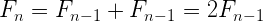

# Combine Two Strings

_source [Programming Interview Questions 6: Combine Two Strings](http://www.ardendertat.com/2011/10/10/programming-interview-questions-6-combine-two-strings/)_

We are given 3 strings: str1, str2, and str3. Str3 is said to be a shuffle of str1 and str2 if it can be formed by interleaving the characters of str1 and str2 in a way that maintains the left to right ordering of the characters from each string. For example, given str1=”abc” and str2=”def”, str3=”dabecf” is a valid shuffle since it preserves the character ordering of the two strings. So, given these 3 strings write a function that detects whether str3 is a valid shuffle of str1 and str2.

We will use recursion to solve the problem, but first we check whether the length of str1 plus str2 equals to the length of str3. If not, then str3 can’t be a valid shuffle since it contains extra characters, so we return false immediately. Recursion happens as follows. If the first characters of str1 and str3 are the same, then we’ll recurse with new str1 and str3 being all but first characters of the strings, and str2 will stay the same. If first characters of str2 and str3 are the same, then we’ll do the same thing with new str2 and str3 being all but first characters, and str1 the same. Now this is the same problem with shorter strings, so it’s very suitable for recursion. If neither str1’s nor str2’s first character equals str3’s first character, we return false. The base case of the recursion is, if any of the strings is empty then the concatenation of str1 and str2 should be equal to str3. Here is the python code:

```python
def isShuffle(str1, str2, str3):
    if len(str1)+len(str2)!=len(str3):
        return False
 
    if not str1 or not str2 or not str3:
        if str1+str2==str3:
            return True
        else:
            return False
 
    if str1[0]!=str3[0] and str2[0]!=str3[0]:
        return False
 
    if str1[0]==str3[0] and isShuffle(str1[1:], str2, str3[1:]):
            return True
    if str2[0]==str3[0] and isShuffle(str1, str2[1:], str3[1:]):
            return True
 
    return False
```

The algorithm effectively uses recursion to solve a smaller instance of the same problem. However, the complexity is exponential. Since we don’t cache the evaluated results, we may try to evaluate the same input strings again and again. It becomes clear when we draw the recursion tree. We can also look at the recurrence relation and verify.



n is the number of characters in str3. There are two terms in the relation, one for each recursion described above. The recurrence relation is similar to Fibonacci numbers, and it’s exponential. So, we need to perform dynamic programming and cache the already evaluated results to avoid precomputation. Once we see that two input strings don’t produce a valid shuffle, we cache this information (if they do produce a valid shuffle then we’re done and return True, so no need to cache). In the beginning of the function we will check whether we evaluated the given input strings before trying to compute again.  If we did, then we won’t try again and immediately return False. Here is the code with caching:

```python
def isShuffle2(str1, str2, str3, cache=set()):
    if (str1, str2) in cache:
        return False
 
    if len(str1)+len(str2)!=len(str3):
        return False
 
    if not str1 or not str2 or not str3:
        if str1+str2==str3:
            return True
        else:
            return False
 
    if str1[0]!=str3[0] and str2[0]!=str3[0]:
        return False
 
    if str1[0]==str3[0] and isShuffle2(str1[1:], str2, str3[1:], cache):
            return True
    if str2[0]==str3[0] and isShuffle2(str1, str2[1:], str3[1:], cache):
            return True
 
    cache.add( (str1, str2) )
 
    return False
```

The cache is a set where the key is the tuple of str1 and str2. We cache the values we already know that can’t produce a valid shuffle and check before trying again. The complexity of this solution is O(NM) where the N and M are the lengths of str1 and str2 respectively. So, from exponential we reduced the complexity to quadratic by using dynamic programming. This is the worst case complexity though, average case would be better.

This question demonstrates effective use of recursion and dynamic programming to achieve an efficient solution.
