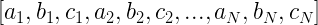
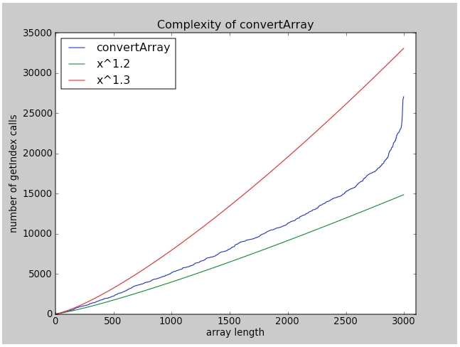

# Convert Array

_source [Programming Interview Questions 9: Convert Array](http://www.ardendertat.com/2011/10/18/programming-interview-questions-9-convert-array/)_

Given an array:


convert it to:



in-place using constant extra space.

This is a tricky question because we could solve it pretty easily if were allowed to construct a new array. The element at the ith position in the final array is at position `(i%3)*N + i/3` in the original array. So, the code is simply:

```python
def getIndex(currentIndex, N):
    return (currentIndex%3)*N + (currentIndex/3)
 
def convertArray_extraSpace(arr):
    N=len(arr)/3
    return [arr[getIndex(i, N)] for i in range(len(arr))]
```

The getIndex function takes an index from the final array, and returns the index of the element in the original array that should appear at that position. However, we aren’t allowed use extra space, we should instead modify the array in-place. We could use a similar approach though, at each iteration we can put the ith element to its final location using the getIndex function above and swap elements. The algorithm works as follows, at each iteration (currentIndex) we get the index of the item that should appear at that location (swapIndex) by calling the getIndex function. The element at swapIndex is the final element to appear at currentIndex. So we swap the elements at currentIndex and swapIndex, if swapIndex>=currentIndex. But if swapIndex<currentIndex then it means that the element at swapIndex was replaced with another element at previous iterations. Now it’s somewhere else and we should keep looking for that element. We again call getIndex with swapIndex as new input to find the element it was replaced with. If the new swapIndex>=currentIndex, we swap the elements as before. Otherwise, we repeat this procedure until swapIndex>=currentIndex, which is we find the final element that’s supposed to appear at currentIndex. The code will make everything clear:

```python
def convertArray(arr):
    N=len(arr)/3
    for currentIndex in range(len(arr)):
        swapIndex=getIndex(currentIndex, N)
        while swapIndex<currentIndex:
            swapIndex=getIndex(swapIndex, N)
        arr[currentIndex], arr[swapIndex] = arr[swapIndex], arr[currentIndex]
```

The algorithm is pretty simple and in-place without using extra space. Let’s work through an example to clarify, here is the program flow for an array of size 15. Swap index is calculated multiple times for some elements until swapIndex>=currentIndex as explained above.

```python
currentIdx=0, swapIdx=0, swapIdx>=currentIdx, swap arr[0] arr[0]
currentIdx=1, swapIdx=5, swapIdx>=currentIdx, swap arr[1] arr[5]
currentIdx=2, swapIdx=10, swapIdx>=currentIdx, swap arr[2] arr[10]
currentIdx=3, swapIdx=1, swapIdx<currentIdx, no swap
  swapIdx=1, newSwapIdx=5, newSwapIdx>=currentIdx, swap arr[3] arr[5]
currentIdx=4, swapIdx=6, swapIdx>=currentIdx, swap arr[4] arr[6]
currentIdx=5, swapIdx=11, swapIdx>=currentIdx, swap arr[5] arr[11]
currentIdx=6, swapIdx=2, swapIdx<currentIdx, no swap
  swapIdx=2, newSwapIdx=10, newSwapIdx>=currentIdx, swap arr[6] arr[10]
currentIdx=7, swapIdx=7, swapIdx>=currentIdx, swap arr[7] arr[7]
currentIdx=8, swapIdx=12, swapIdx>=currentIdx, swap arr[8] arr[12]
currentIdx=9, swapIdx=3, swapIdx<currentIdx, no swap
  swapIdx=3, newSwapIdx=1, newSwapIdx<currentIdx, no swap
  swapIdx=1, newSwapIdx=5, newSwapIdx<currentIdx, no swap
  swapIdx=5, newSwapIdx=11, newSwapIdx>=currentIdx, swap arr[9] arr[11]
currentIdx=10, swapIdx=8, swapIdx<currentIdx, no swap
  swapIdx=8, newSwapIdx=12, newSwapIdx>=currentIdx, swap arr[10] arr[12]
currentIdx=11, swapIdx=13, swapIdx>=currentIdx, swap arr[11] arr[13]
currentIdx=12, swapIdx=4, swapIdx<currentIdx, no swap
  swapIdx=4, newSwapIdx=6, newSwapIdx<currentIdx, no swap
  swapIdx=6, newSwapIdx=2, newSwapIdx<currentIdx, no swap
  swapIdx=2, newSwapIdx=10, newSwapIdx<currentIdx, no swap
  swapIdx=10, newSwapIdx=8, newSwapIdx<currentIdx, no swap  
  swapIdx=8, newSwapIdx=12, newSwapIdx>=currentIdx, swap arr[12] arr[12]
currentIdx=13, swapIdx=9, swapIdx<currentIdx, no swap
  swapIdx=9, newSwapIdx=3, newSwapIdx<currentIdx, no swap
  swapIdx=3, newSwapIdx=1, newSwapIdx<currentIdx, no swap
  swapIdx=1, newSwapIdx=5, newSwapIdx<currentIdx, no swap
  swapIdx=5, newSwapIdx=11, newSwapIdx<currentIdx, no swap
  swapIdx=13, newSwapIdx=13, newSwapIdx>=currentIdx, swap arr[13] arr[13]
currentIdx=14, swapIdx=14, currentIdx>=swapIdx, swap arr[14] arr[14]
```

The time complexity of this algorithm depends on the number of times getIndex function is called. It’s not linear because for some indexes the getIndex function is called multiple times, it’s not quadratic as well because not for every element the getIndex is called repetitively. We can see both of the cases above. So, the complexity is between linear and quadratic, which is sometimes called as super-linear. To be precise, the complexity is approximately O(N^1.3) as we can see from the figure below:



Here is the code to generate the plot, assuming that we changed the function convertArray to also count and return the number of calls made to getIndex function:

```python
def complexityAnalysis():
    x=range(3, 1000, 3)
    y=[convertArray(range(num)) for num in x]
    pylab.plot(x, sorted(y), label='convertArray')
    pylab.plot(x, map(lambda num: num**1.2, x), label='x^1.2')
    pylab.plot(x, map(lambda num: num**1.3, x), label='x^1.3')
    pylab.legend(loc='upper left')
    pylab.title('Complexity of convertArray')
    pylab.xlabel('array length')
    pylab.ylabel('number of getIndex calls')
    pylab.show()
```
