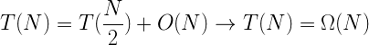
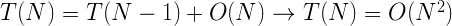
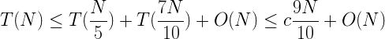
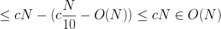

# Kth Largest Element in Array

_source [Programming Interview Questions 10: Kth Largest Element in Array](http://www.ardendertat.com/2011/10/27/programming-interview-questions-10-kth-largest-element-in-array/)_

Given an array of integers find the kth element in the sorted order (not the kth distinct element). So, if the array is [3, 1, 2, 1, 4] and k is 3 then the result is 2, because it’s the 3rd element in sorted order (but the 3rd distinct element is 3).

The first approach that comes to mind is sorting the array and returning the kth element. The complexity is NlogN where N is size of the array and it’s clearly not optimal. Because this solution does more work than needed, it finds the absolute ordering of all elements but we’re only looking for the kth largest element. We would ideally prefer a linear time solution.

We can use the [Selection Algorithm](http://en.wikipedia.org/wiki/Selection_algorithm) as used in quicksort. It works as follows, select a pivot and partition the array to left and right subarrays such that, the elements that are smaller than the pivot value end up in the left group, and the ones that are and larger than or equal to the pivot are in the right group. Now, only the pivot is in its sorted position. The remaining elements are not sorted but their relative position to the pivot, whether they are on the left or right, is as in sorted order. Let’s say after partitioning the array the position of the pivot in the array is m. If m is equal to k, then the pivot is exactly the kth element that we’re looking for, so we return the pivot value. If m is less than k, then the kth element is in the right subarray. Else if m is greater than k, then the kth element is in the left subarray. So we can recursively call the same procedure and find the kth element. The code will make everything clear:

```python
def partition1(arr, left, right, pivotIndex):
    arr[right], arr[pivotIndex]=arr[pivotIndex], arr[right]
    pivot=arr[right]
    swapIndex=left
    for i in range(left, right):
        if arr[i]<pivot:
            arr[i], arr[swapIndex] = arr[swapIndex], arr[i]
            swapIndex+=1
    arr[right], arr[swapIndex]=arr[swapIndex], arr[right]
    return swapIndex

def kthLargest1(arr, left, right, k):
    if not 1<=k<=len(arr):
        return
    if left==right:
        return arr[left]

    while True:
        pivotIndex=random.randint(left, right)
        pivotIndex=partition1(arr, left, right, pivotIndex)
        rank=pivotIndex-left+1
        if rank==k:
            return arr[pivotIndex]
        elif k<rank:
            return kthLargest1(arr, left, pivotIndex-1, k)
        else:
            return kthLargest1(arr, pivotIndex+1, right, k-rank)
```

The partition function divides the array to two subarrays as described above. The pivot used in partition is selected uniformly at random to potentially avoid worst case performance. We search for the kth element within the indexes [left, right]. Left is initially 0 and right is length of array – 1. If the rank of the pivot is equal to k after partitioning, then the pivot itself is the kth element so we return. Otherwise, we recurse by adjusting the bounds. If the rank of the pivot is greater than k, then we should continue our search in the left subarray, so the new array bounds become [left, pivotIndex-1]. Else if the rank of the pivot is less than k, then we continue to search in the right subarray, so the bounds become [pivotIndex+1, right]. The value of k also gets adjusted if we’re searching the right subarray since we change the left index, so the new value of k becomes k-rank, meaning we count out rank number of elements that we’re eliminating at the left portion of the array.

The average time complexity of this approach is O(N). But worst case complexity is unfortunately O(N^2), which occurs if we make poor pivot selections that doesn’t partition the array well, and leaves most of the elements at one side and very few at the other. In the extreme case the partition results in 0 elements at one side and all others at the other side, when smallest or largest element is chosen as pivot. As a result we can only eliminate 1 element at each step, leading to quadratic time complexity. Conversely the best case performance occurs when the pivot divides the array into to equal sized partitions, which results in a linear complexity. Here are the recurrence relations for best and worst case, best case is linear worst case is quadratic. Average case also turns out to be linear (proof omitted).

Best case:



Worst case:



There’s a very elegant algorithm that has worst case linear time performance, which is called [Median of Medians Algorithm](http://en.wikipedia.org/wiki/Selection_algorithm#Linear_general_selection_algorithm_-_Median_of_Medians_algorithm). It’s discovered by 5 great computer scientists, Manuel Blum (Blum speedup theorem), Robert Floyd (Floyd-Warshall shortest path algorithm), Vaughan Pratt (Pratt primality certificate), Ron Rivest (RSA cryptography algorithm), and Robert Tarjan (graph algorithms and data structures). Median of medians is a modified version of selection algorithm where we improve pivot selection to guarantee reasonable good worst case split. The algorithm divides the array to groups of size 5 (the last group can be of any size < 5). Then calculates the median of each group by sorting and selecting the middle element (sorting complexity of 5 elements is negligible). Finds the median of these medians by recursively calling itself, and selects the median of medians as the pivot for partition. Then it continues similar to the previous selection algorithm by recursively calling the left or right subarray depending on the rank of the pivot after partitioning. The partition function is slightly different though, partition1 function above takes the index of the pivot as input, partition2 here takes the value of the pivot as input, which is only a slight modification. Here is the code:

```python
def partition2(arr, left, right, pivot):
    swapIndex=left
    for i in range(left, right+1):
        if arr[i]<pivot:
            arr[i], arr[swapIndex] = arr[swapIndex], arr[i]
            swapIndex+=1
    return swapIndex-1

def kthLargest2(arr, left, right, k):
    length=right-left+1
    if not 1<=k<=length:
        return
    if length<=5:
        return sorted(arr[left:right+1])[k-1]

    numMedians=length/5
    medians=[kthLargest2(arr, left+5*i, left+5*(i+1)-1, 3) for i in range(numMedians)]
    pivot=kthLargest2(medians, 0, len(medians)-1, len(medians)/2+1)
    pivotIndex=partition2(arr, left, right, pivot)
    rank=pivotIndex-left+1
    if k<=rank:
        return kthLargest2(arr, left, pivotIndex, k)
    else:
        return kthLargest2(arr, pivotIndex+1, right, k-rank)
```

The worst case complexity of this approach is O(N) because the median of medians chosen as pivot is either greater than or less than at least 30% of the elements. So even in the worst case we can eliminate constant proportion of the elements at each iteration, which is what we wanted but couldn’t achieve with the previous approach. We can also write the recurrence relation for worst case and verify that it’s linear. N/5 term comes from selecting the median of medians as pivot, and 7N/10 is when the pivot produces the worst split.




This is a great algorithm but admittedly kind of hard to come up with during an interview if you haven’t seen it before. At least it took 5 great minds to figure it out. But it’s of course good to know and definitely worth the extra effort.

