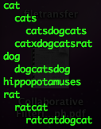

# Longest Compound Word

_source [Programming Interview Questions 28: Longest Compound Word](http://www.ardendertat.com/2012/06/15/programming-interview-questions-28-longest-compound-word/)_

This is my last post of the long programming interview questions series. I’m starting my first full-time job next week at Microsoft Bing Relevance team. Wish me luck..

Given a sorted list of words, find the longest compound word in the list that is constructed by concatenating the words in the list. For example, if the input list is: [‘cat’, ‘cats’, ‘catsdogcats’, ‘catxdogcatsrat’, ‘dog’, ‘dogcatsdog’, ‘hippopotamuses’, ‘rat’, ‘ratcat’, ‘ratcatdog’, ‘ratcatdogcat’]. Then the longest compound word is ‘ratcatdogcat’ with 12 letters. Note that the longest individual words are ‘catxdogcatsrat’ and ‘hippopotamuses’ with 14 letters, but they’re not fully constructed by other words. Former one has an extra ‘x’ letter, and latter is an individual word by itself not a compound word.

We will use the trie data structure, also known as a prefix tree. Tries are space and time efficient structures for text storage and search.  They let words to share prefixes, and prefixes are exactly what we’ll be dealing with in this question. There’s a sample trie implementation in a previous question find word positions in text. The one we’re going to use is slightly modified, with a different node definition and two additional Trie class functions:

```python
class Node:
    def __init__(self, letter=None, isTerminal=False):
        self.letter=letter
        self.children={}
        self.isTerminal=isTerminal

def insert(self, word):
    current=self.root
    for letter in word:
        if letter not in current.children:
            current.children[letter]=Node(letter)
        current=current.children[letter]
    current.isTerminal=True

def getAllPrefixesOfWord(self, word):
    prefix=''
    prefixes=[]
    current=self.root
    for letter in word:
        if letter not in current.children:
            return prefixes
        current=current.children[letter]
        prefix+=letter
        if current.isTerminal:
            prefixes.append(prefix)
    return prefixes
```

The isTerminal field in a Node class means that the word constructed by letters from the root to the current node is a valid word. For example the word cat is formed by 3 nodes, one for each letter. And the last letter ‘t’ has isTerminal value True.

The insert function of the trie just adds the given word to the trie. The more important getAllPrefixesOfWord function takes a word as input, and returns all the valid prefixes of that word. Where valid means that prefix word appears in the given input list. The list being sorted helps us here. While scanning the list from the beginning, all the prefixes of the current word have already been seen and added to the trie. So finding all the prefixes of a word can be done easily by following a single path down from the root with nodes being the letters of the word, and returning the prefix words corresponding to nodes with true isTerminal value

.

The algorithm works as follows, we scan the input list from the beginning and insert each word into the trie. Right after inserting a word, we check whether it has any prefixes. If yes, then it’s a candidate for the longest compound word. We append a pair of current word and its suffix (word-prefix) into a queue. The reason is that the current word is a valid construct only if the suffix is also a valid word or a compound word. So we build the trie and queue while scanning the array.

Let’s illustrate the process with an example, the first word is cat and we add it to the trie. Since it doesn’t have a prefix, we continue. Second word is cats, we add it to the trie and check whether it has a prefix, and yes it does, the word cat. So we append the pair <‘cats’, ‘s’> to the queue, which is the current word and the suffix. The third word is catsdogcats, we again insert it to the trie and see that it has 2 prefixes, cat and cats. So we add 2 pairs <‘catsdogcats’, ‘sdogcats’> and <‘catsdogcats’, ‘dogcats’> where the former suffix correspond to the prefix cat and the latter to cats. We continue like this by adding <‘catxdogcatsrat’, ‘xdogcatsrat’> to the queue and so on. And here’s the trie formed by adding example the words in the problem definition:



After building the trie and the queue, then we start processing the queue by popping a pair from the beginning. As explained above, the pair contains the original word and the suffix we want to validate. We check whether the suffix is a valid or compound word. If it’s a valid word and the original word is the longest up to now, we store the result. Otherwise we discard the pair. The suffix may be a compound word itself, so we check if the it has any prefixes. If it does, then we apply the above procedure by adding the original word and the new suffix to the queue. If the suffix of the original popped pair is neither a valid word nor has a prefix, we simply discard that pair.

An example will clarify the procedure, let’s check the pair <‘catsdogcats’, ‘dogcats’> popped from the queue. Dogcats is not a valid word, so we check whether it has a prefix. Dog is a prefix, and cats is the new suffix. So we add the pair <‘catsdogcats’, ‘cats’> to the queue. Next time we pop this pair we’ll see that cats is a valid word and finish processing the word catsdogcats. As you can see, the suffix will get shorter and shorter at each iteration, and at some point the pair will either be discarded or stored as the longest word. And as the pairs are being discarded, the length of the queue will decrease and the algorithm will gradually come to an end. Here’s the complete algorithm:

```python
def longestWord(words):
    #Add words to the trie, and pairs to the queue
    trie=Trie()
    queue=collections.deque()
    for word in words:
        prefixes=trie.getAllPrefixesOfWord(word)
        for prefix in prefixes:
            queue.append( (word, word[len(prefix):]) )
        trie.insert(word)

    #Process the queue
    longestWord=''
    maxLength=0
    while queue:
        word, suffix = queue.popleft()
        if suffix in trie and len(word)&gt;maxLength:
            longestWord=word
            maxLength=len(word)
        else:
            prefixes=trie.getAllPrefixesOfWord(suffix)
            for prefix in prefixes:
                queue.append( (word, suffix[len(prefix):]) )

    return longestWord
```

The complexity of this algorithm is O(kN) where N is the number of words in the input list, and k the maximum number of words in a compound word. The number k may vary from one list to another, but it’ll generally be a constant number like 5 or 10. So, the algorithm is linear in number of words in the list, which is an optimal solution to the problem.

And here’s the impementation of the trie for completeness:

```python
class Trie:
    def __init__(self):
        self.root=Node('')

    def __repr__(self):
        self.output([self.root])
        return ''

    def output(self, currentPath, indent=''):
        #Depth First Search
        currentNode=currentPath[-1]
        if currentNode.isTerminal:
            word=''.join([node.letter for node in currentPath])
            print indent+word
            indent+='  '
        for letter, node in sorted(currentNode.children.items()):
            self.output(currentPath[:]+[node], indent)

    def insert(self, word):
        current=self.root
        for letter in word:
            if letter not in current.children:
                current.children[letter]=Node(letter)
            current=current.children[letter]
        current.isTerminal=True

    def __contains__(self, word):
        current=self.root
        for letter in word:
            if letter not in current.children:
                return False
            current=current.children[letter]
        return current.isTerminal

    def getAllPrefixesOfWord(self, word):
        prefix=''
        prefixes=[]
        current=self.root
        for letter in word:
            if letter not in current.children:
                return prefixes
            current=current.children[letter]
            prefix+=letter
            if current.isTerminal:
                prefixes.append(prefix)
        return prefixes
```

