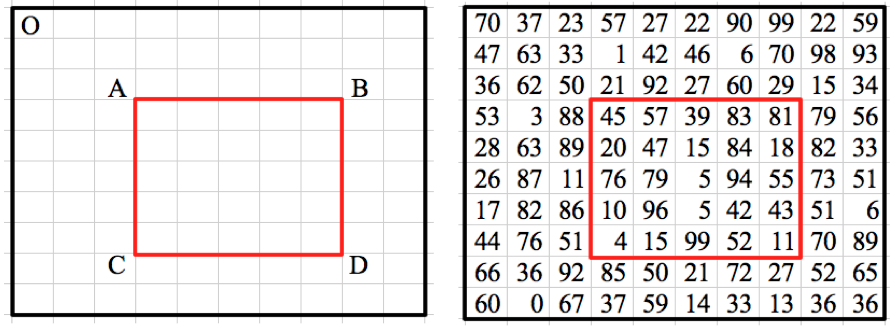
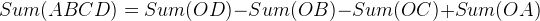

# Matrix Region Sum

_source [Programming Interview Questions 2: Matrix Region Sum](http://www.ardendertat.com/2011/09/20/programming-interview-questions-2-matrix-region-sum/)_

This is a very elegant question which seems easy at first but requires some hard thinking to solve it efficiently: Given a matrix of integers and coordinates of a rectangular region within the matrix, find the sum of numbers falling inside the rectangle. Our program will be called multiple times with different rectangular regions from the same matrix.



It seems very easy right? Just write a double for loop and sum up the numbers. Given the integer matrix, top left and bottom right coordinates of the rectangular region, the algorithm would simply be:

```python
def matrixRegionSum1(matrix, A, D):
    if len(matrix)==0:
        return
    totalSum=0
    for i in range(A[0], D[0]+1):
        for j in range(A[1], D[1]+1):
            totalSum+=matrix[i][j]
    return totalSum
```

The complexity of this solution is O(MN) where M is the number of rows of the matrix, and N is the number of columns. This is a fairly straightforward solution that initially comes to mind. However, it’s far from optimal because we’re not caching any data and all the subsequent calls to the program has the same complexity. Since this routine will be executed multiple times, ideally we want every call to the function to take constant O(1) time without using too much extra space.

We should precompute and cache some data in order to reduce the complexity to O(1). The precomputation complexity is not that important since it will be performed just once in the beginning, and the cached data will be used to speed up the subsequent calls to the function. Let’s see what we can precompute. To achieve an O(1) solution, we can precompute the sum of every possible rectangular region inside the matrix, and store it in a hashtable for later use. Afterwards, when we are asked the sum of a rectangular region, we will just return the precomputed value in constant time. However, the space complexity of this approach would be O(M^2N^2) which is too much. Because there are MN different candidates for both top left and bottom right coordinates of the rectangle.

Precomputing and caching the sums of all rectangles results in a constant time algorithm, but it uses a lot of space. Let’s think whether we can reduce the space complexity to a reasonable amount. The main inefficiency was to store the sum of all possible rectangular regions, instead we can store a subset of them and still achieve constant complexity. Let’s calculate the sum of all rectangular regions whose top left corner is always the point ‘O’ in the above figure (top left corner of the matrix) and bottom right corner is any point in the matrix. By doing this we fix the top left coordinate of the precomputed regions and reduce the number of cached sums to O(MN), because only the bottom right corner of the rectangles is free. So the space complexity reduces to O(MN). Now the question is whether we can compute the sum of any rectangular region using only the precomputed sums of regions whose top left coordinate is the point ‘O’. Apparently we can, here is how it works:


Given a random rectangular region ABCD, we can calculate its sum using the sums of 4 precomputed rectangular regions all of which top left corner is the point ‘O’.



Elegant, isn’t it? Here is the code to precompute the sum of all rectangular regions whose top left coordinate is the point ‘O’. It uses dynamic programming to efficiently compute the sums. The complexity is O(MN) which is optimal because we wanted to compute the sum of MN different rectangular regions. So each region sum is computed in O(1) time by using the sum of the previous regions by dynamic programming.

```python
def precomputeSums(matrix):
    topRow, bottomRow=(0, len(matrix)-1)
    leftCol, rightCol=(0, len(matrix[0])-1)
    sums=[[0]*(rightCol-leftCol+1) for i in range(bottomRow-topRow+1)]
    sums[topRow][leftCol]=matrix[topRow][leftCol]

    for col in range(leftCol+1, rightCol+1):
        sums[topRow][col]=sums[topRow][col-1]+matrix[topRow][col]
    for row in range(topRow+1, bottomRow+1):
        sums[row][leftCol]=sums[row-1][leftCol]+matrix[row][leftCol]

    for col in range(leftCol+1, rightCol+1):
        columnSum=matrix[topRow][col]
        for row in range(topRow+1, bottomRow+1):
            sums[row][col]=sums[row][col-1]+matrix[row][col]+columnSum
            columnSum+=matrix[row][col]

    return sums
```

Once we have the precomputed sums, we use the above formula to compute the sum of any rectangular region in O(1).

```python
def matrixRegionSum2(matrix, A, D, sums):
    if len(matrix)==0:
        return

    if A[0]==0 or A[1]==0:
        OA=0
    else:
        OA=sums[A[0]-1][A[1]-1]

    if A[1]==0:
        OC=0
    else:
        OC=sums[D[0]][A[1]-1]

    if A[0]==0:
        OB=0
    else:
        OB=sums[A[0]-1][D[1]]

    OD=sums[D[0]][D[1]]

    return OD-OB-OC+OA
```

I personally like this question a lot because it demonstrates how an easy question can be solved very efficiently using precomputation, dynamic programming, and clever thinking.

