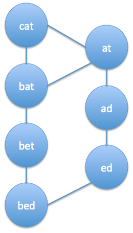
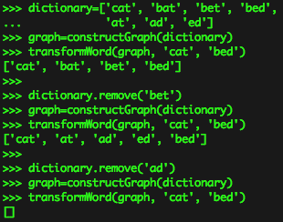

# Transform Word

_source [Programming Interview Questions 8: Transform Word](http://www.ardendertat.com/2011/10/17/programming-interview-questions-8-transform-word/)_

Given a source word, target word and an English dictionary, transform the source word to target by changing/adding/removing 1 character at a time, while all intermediate words being valid English words. Return the transformation chain which has the smallest number of intermediate words.

This is again one of my favorite interview questions. It demonstrates how we can formulate a particular problem differently and solve the new problem easily and elegantly. Here, we can formulate the question as a graph problem and the solution will turn out to be a simple breadth first search.

We should perform preprocessing on the given dictionary. Let all the words in the dictionary be the nodes of a graph, and there is an undirected edge between two nodes if one word could be converted to another by a single transformation: changing a character, removing a character, or deleting a character. For example there will be an edge between “bat” and “cat” since we can change a character, also between “cat” and “at” by removing a character, and between “bat” and “bart” by adding a character. We can preprocess the whole dictionary and create this huge graph. Assuming that our program will be asked to transform different words to one another many times,  the cost of precomputation will be negligible. Here is the code to create the graph from the dictionary, the graph is a hashtable where the key is a word and the value is the list of valid transformations of that word:

```python
def constructGraph(dictionary):
    graph=collections.defaultdict(list)
    letters=string.lowercase
    for word in dictionary:
        for i in range(len(word)):
            #remove 1 character
            remove=word[:i]+word[i+1:]
            if remove in dictionary:
                graph[word].append(remove)
            #change 1 character
            for char in letters:
                change=word[:i]+char+word[i+1:]
                if change in dictionary and change!=word:
                    graph[word].append(change)
        #add 1 character
        for i in range(len(word)+1):
            for char in letters:
                add=word[:i]+char+word[i:]
                if add in dictionary:
                    graph[word].append(add)

    return graph
```

Now we have the graph where each edge corresponds to a valid transformation between words. So, given two words we can initiate a breadth first search from the start node and once we reach the goal node we will have the shortest chain of transformations between two words (note that either start or goal or both words may not exist in the dictionary at all). Breadth first search gives the shortest path between a start node and a goal node in an unweighted graph, given that the start node is the root of the search. We didn’t perform depth first search because it won’t necessarily give us the shortest path and we may waste a lot of time trying to explore a dead end because the graph contains many nodes. Here is the code, it takes the graph generated above as an input together with start and goal words:

```python
def transformWord(graph, start, goal):
    paths=collections.deque([ [start] ])
    extended=set()
    #Breadth First Search
    while len(paths)!=0:
        currentPath=paths.popleft()
        currentWord=currentPath[-1]
        if currentWord==goal:
            return currentPath
        elif currentWord in extended:
            #already extended this word
            continue

        extended.add(currentWord)
        transforms=graph[currentWord]
        for word in transforms:
            if word not in currentPath:
                #avoid loops
                paths.append(currentPath[:]+[word])

    #no transformation
    return []
```

The complexity of the algorithm depends on how far apart two words are in the graph. In the worst case, we may have to traverse all the graph to find a transformation, or such a transformation may not exist at all, meaning the graph has more than 1 connected components. Or either the source or the goal or both may not exist in the dictionary.

Here is an example, let’s say we have the following words in our dictionary: cat, bat, bet, bed, at, ad, ed. The transformation graph is the following:



Let’s say we want to find the shortest transformation between the words cat and bed. Here is the demonstration of how it works:



There are two paths. cat->bat->bet->bed is shorter than cat->at->ad->ed->bed. If we delete the node ‘bet’ than the first path becomes invalid and the shortest path is now the second one. If we also delete ‘ad’ then there is no path left.

This question demonstrates the power of graphs and formulating a problem as a graph can reduce a difficult task to a classic traversal algorithm.
